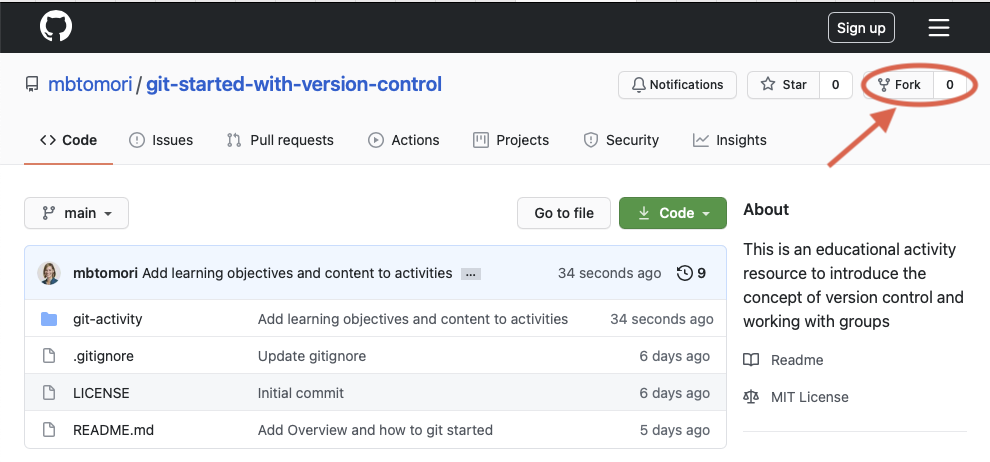
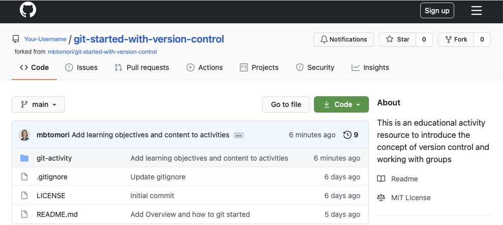
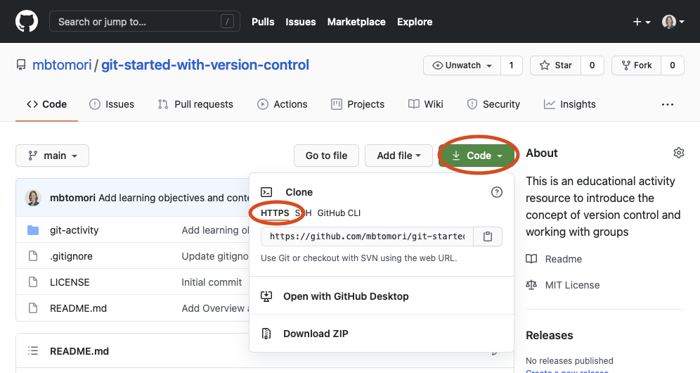

# Activity 2: `git`ing started with your own fork

## Learning Outcomes
- [ ] Identify when you are using git and when you are using GitHub
- [ ] Use GitHub to fork a repository
- [ ] Use Git to clone a repository to your computer

Now that you can differentiate between [git and GitHub](2-what-is-git.md), it's time to cement that understanding
by creating a fork of this repository and getting a copy of it on your own machine. 

## Activity:
In this activity, you will create your own copy of this repository in your GitHub account (as a fork) and then clone it
to your computer. 
### 1. Create a fork of this repository
**DID YOU KNOW?** When you contribute to open source software, you will often create a fork of the existing repository, make updates
to your individual copy of the repository, and then try to submit (via pull request) to the original repo. You are less
likely to fork a repository when you work at a company and will clone the repository instead (step 2). 

1. Register for a GitHub account or Login to your existing account at [github.com](https://github.com).
2. Fork the repository to your account by pressing the "Fork" button at the top right. 

 *If you have multiple organizations, choose your personal account to fork it into.*  
3. You should now have a copy of your own version of this repository in your account! It should look something like this:

   
### 2. Clone your fork to your computer
1. Click on the "Code" button. Click HTTPS and copy the URL in the box (If you have set up SSH with GitHub, 
   you can select SSH). 
   
2. Using your command line, navigate to the location you want to put the repository in.
3. Type `git clone <URL> //ignore the <> symbols`.  
   ex. `git clone https://github.com/your-username/git-started-with-version-control.git`
4. Enter your github login credentials (*NOTE: You won't be able to see what you type as you type.*)   
5. You should now have a copy of your forked repository on your computer. 

**Some cool things to note: **
1. You can go through this process for as many computers, machines, virtual machines you use. 
That's one of the great things about git. So, say you originally have this repository in a virtual environment and you
want it on your computer directly as well. Just go through these cloning steps, and you will be able to have it in both places!
2. When you work at a company, you will likely clone the project(s) you're working on without creating
forks.

## Checking your understanding:
Open this file in a Text Editor or IDE of your choice, and add your answers (just type them in where it says <ANSWER HERE>)
1. When you forked this repository, were you using Git or GitHub? Explain your reasoning.
   <ANSWER HERE>
2. When you cloned this repository, were you using Git or GitHub? Explain your reasoning.
   <ANSWER HERE>
3. In your own words, explain the difference between Git and GitHub.
   <ANSWER HERE>

#### Common `Git` commands:
- [`git commit`](https://www.atlassian.com/git/tutorials/saving-changes/git-commit)
