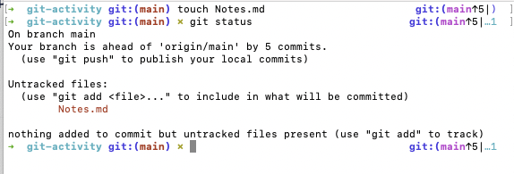
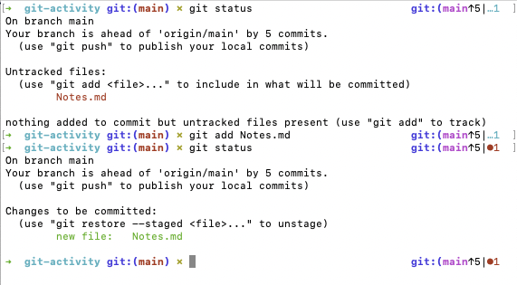
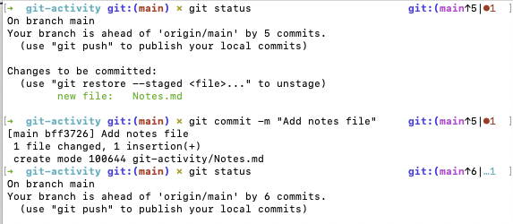
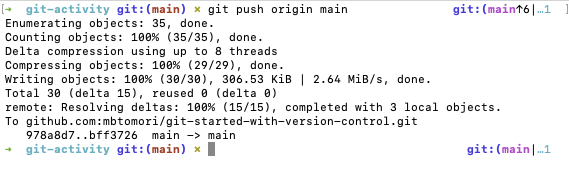

# Activity 4: The `git` workflow for independent projects

## Learning Outcomes
- [ ] Explain what common `git` commands do
- [ ] Use an existing workflow to create a new file in your repository. 

**NOTE: At this point, you should be using your local copy of your forked repository to go through this tutorial 
so you can do the activities. You should not be reading this on the GitHub website.**

Now that you know how version control can benefit you in your development, let's go through a workflow to use
when you are working by yourself. This workflow will explain each of the commands. You can use it as a cheatsheet
when you are working on any project. 

## Activity:
When you work on simple projects, you can most often do all of your work in the `main` branch. When you start working on 
more complicated projects, you may want to utilize branches. In that case, look at the [Collaboration]() Workflow which 
covers branches. 

For simple projects, the workflow most often includes committing, pushing, and pulling.

#### The Importance of the git commit
Back in the day before automatic saving, folks used to implore others to "save early and often." You want to think
about using this workflow that way. You want to do this early and often. Think of commits as markers that you leave
along a path. In git, you cannot go back to a state that is inbetween two markers, but you can go back to any marker. 
If you only have a marker at the beginning and end, you will have a very difficult time seeing what your code 
looked like in the middle. 

I suggest committing code everytime you get a piece of something done or in a "working" state. It doesn't even have 
to be working though, you can commit code that isn't working so that you have a marker you can return to just in case. 

#### What is a Git Commit?
>The git commit command captures a snapshot of the project's currently staged changes. Committed snapshots can be 
thought of as “safe” versions of a project—Git will never change them unless you explicitly ask it to. [Atlassian: Git Commit](https://www.atlassian.com/git/tutorials/saving-changes/git-commit)

#### The Committing Process
1. Before making any changes, be sure you have the most recent version of your repository. 
   `git pull origin main`
   This pulls any changes from GitHub to your local repository. 
2. Create a new file in this repository. Call it Notes (use .md for markdown or .txt for text file). 
3. Add a line of text to your file and save it. 
4. In your command line, type `git status`. You should see something like this:
   
   When a file is unstaged, it means it has been modified, but isn't set up to be committed when you commit changes. 
5. To set the file up for a commit, type `git add <FILENAME>` 
   ex. `git add Notes.md` or `git add Notes.txt`
   `git add` adds files to your staging area so they are set up to be committed when you commit. 
   *NOTE: I highly recommend adding files individually rather than just typing `git add`. If you do not specify the
   files, it will add everything in your directory, even files that you may not intend. To ensure things are as clean
   as possible, always specify the exact file you want to stage. It may be more work now, but it's easier than cleaning
   up files you didn't mean to stage later.* 
6. Check that it has been staged properly by calling `git status` again. You should see something like this:
   
   
   
7. Now that the file is properly staged, you need to commit it. Type `git commit -m "Your message here"`.
   The `-m` is an argument indicating a message (as a String) will follow. When you type `git status` again, 
   your branch should be clean.
   
   
*Know that there are a number of developers who have strong ideas regarding what makes a good commit message. If you're 
interested in diving into that now, take a look at [Chris Beams: How to Write a Good Commit Message](https://chris.beams.io/posts/git-commit/) 
for some tips on writing good commit messages. Keep in mind
that, like everything in software development, there are a TON of differing opinions on this matter.* 

8. Now that everything is committed, you can continue to work on your project and go through steps 2-7 process again. 
9. When you are ready to push your changes to GitHub, type `git push origin main`. This will push your `main` branch
to GitHub. You will likely need to enter your GitHub username and password to push. 
   

And that's it! This is the simplest workflow you can use. As long as you follow this process closely, it should be easy
to make sure you have plenty of commits to keep track of where you've been. 

## Summary Git Workflow:
1. `git pull orign main //get most recent chages` 
2. make your changes
3. `git status //see what files have changed` 
4. `git add <filename> //ex. git add Notes.txt`
5. `git commit -m "Your awesome commit message`
6. `git push origin main //to push to GitHub`

#### Common `Git` commands:
- `git commit`[Atlassian: git commit](https://www.atlassian.com/git/tutorials/saving-changes/git-commit)
- `git add`[Atlassian: git add](https://www.atlassian.com/git/tutorials/saving-changes)
- `git status`[Atlassian: git status](https://www.atlassian.com/git/tutorials/inspecting-a-repository)

#### Troubleshooting
**I accidentally staged all my files! How do I unstage the ones I don't want?** *For each file you want to unstage, 
type `git restore --staged <FILENAME>` (remember to ignore the <>)*
**I wrote a bad git message and want to re-write it** *Follow the instructions here: [How to Change a Git Commit Message](https://linuxize.com/post/change-git-commit-message/)*
**I want to go back to a previous commit** *Commit your current code. Then use `git log` to see the previous commit 
hashes, then type `git checkout <hashid>` to go back to that commit. Once you're there, you'll need to follow all the
steps identified above if you want to save anything. If you are in this position, you may want to utilize branching, which
is discussed in a later section.*