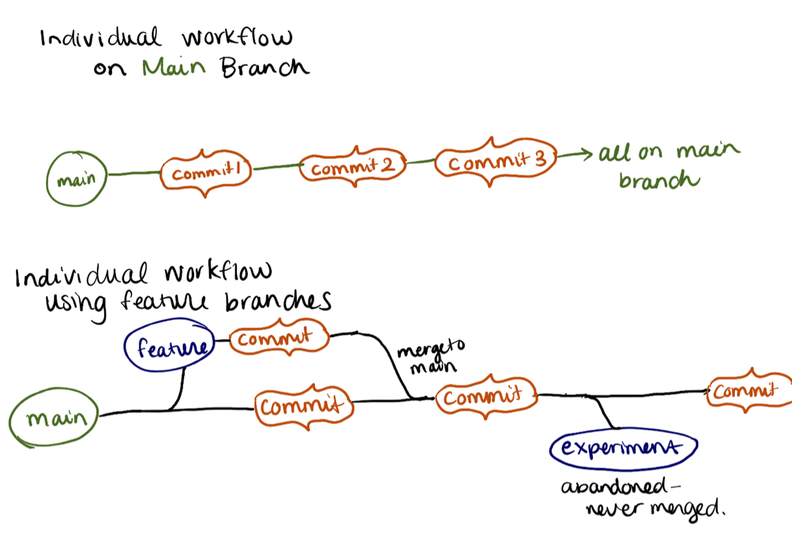
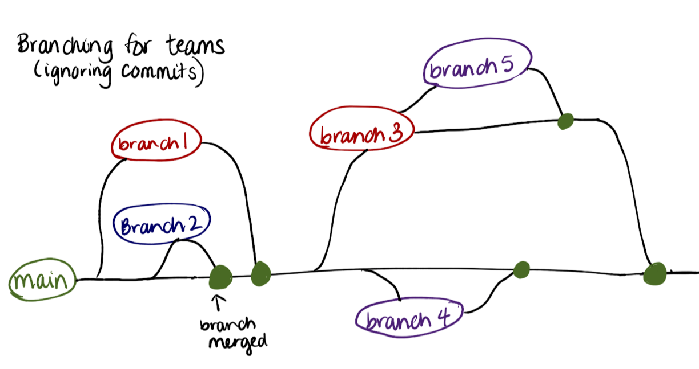
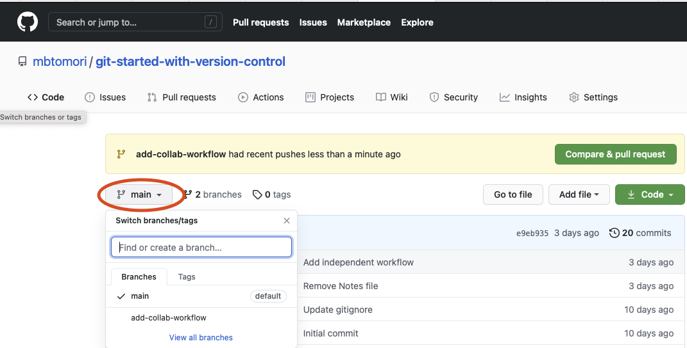

# Activity 5: Collaboration using `git`

## Learning Outcomes
- [ ] Explain how branches help facilitate collaborative software development
- [ ] Describe and use a workflow for collaboration

## Overview

### Branching for individual projects
The [previous lesson](4-independent-project-workflow.md) described a simple workflow where all development occurs
on a single branch, called `main`. While this is great for getting used to using git, there will be inevitably be a time
when you need to use branches to aid development. 

A branch is a pointer to a snapshot of your repository. You can utilize branches for any changes you want to make, 
whether you're fixing a tiny bug or writing a big part of your code. While a branch isn't exactly a copy of the
code up to that point in your development process, it can be thought of as that. You can create a branch from any branch
at any time, and expect that all code written and modified up to that time will be available to you. 

*Technically, a branch resembles the tip of a series of commits and is not a container for commits. 
The history for a branch is extrapolated through the commit relationships.* 
Source: [Atlassian: Git Branches](https://www.atlassian.com/git/tutorials/using-branches)

As mentioned above, you can use branches when you work as an individual. Compare these diagrams:


The top diagram shows the `main` branch with commits. The bottom diagram shows branches that come off of main. 
One is a feature branch. After one commit, it gets merged back into main. But there is also a commit that happens
in the main branch during that time (let's imagine it was a small bug fix). After the feature branch was merged and
another commit added, an experiment branch was created that was abandoned. Development continued on the `main` branch.

As an individual, you can decide how often you want to use branches vs. writing directly on main. It's generally considered
best practice to use branches for most work, but sometimes that adds unnecessary complexity. 

### Collaborating using Branches
When you work on a team, whether that be for a school project or at your job, you will most likely need to get 
approval to merge any code to the main branch. Why? Because the main branch is the primary, clean, working branch that
is pushed to production (and interacted with by other users). Because of this, you want the main branch to be bug-free
at all times. 

So what does this mean? Simply put, it means that you should never develop on the `main` branch directly. Instead, 
you want to create branches off of `main`, pull necessary updates from `main` as you develop, and merge back into main
once your code is ready to go and approved. 

Consider the following scenario. A small team (consisting of Julia, Xavier, and Colleena) are building a new feature
at their company. The company has been around for a few years, so they have a fairly extensive codebase -- all working
code in the `main` branch.



- Julia created `branch1` and worked on building a new model for the feature.
- Xavier created `branch2`, fixed a bug in the code, and merged it to main.
- Colleena was enjoying a well-earned vacation.
- Julia finished their model, got it approved and merged it to main after Xavier's bug fix was merged. Then, Julia 
started working on another model in `branch3`.
- Colleena came back from vacation and needed to work off of Julia's progress, so she created a `branch5` from Julia's
working branch. Colleena merged her work into `branch3`, which then got merged to main.
- But Colleena had another small bit of code cleanup to do, so she created `branch4` and merged that into main.
  
This is a fairly typical way a team uses branching for development. 

You may be wondering, what happens if Julia and Xavier made changes in the same file? What code would be kept?
This is what's called a **merge conflict**, which will be covered in a later section. Everyone will encounter merge
conflicts when working in git, but for now, suffice it to say that:

1. You can minimize merge conflicts by working in different files and not changing code in the same file at the same time.
2. If you pull changes from the main branch frequently, you will be able to avoid large merge conflicts. 

So how do you go about implementing this workflow? Here are the steps:
#### 1. Check that you are on the main branch
Before doing anything, make sure you are on the main branch by typing the following in the terminal. 
```shell
git branch  //returns a list of all branches 
   ```
There should be an asterisk next to main. ```* main```

#### 2. Make sure the code is up to date
```shell
git pull origin main //pulls any merged changes from main
``` 
Sometimes you can use ```git pull``` if you have it set up. You can also use this to pull remote branches, just 
substitute `main` with the branch name you want to pull.

#### 3. Create a new branch to work from.
```shell
git checkout -b  <branch name>  //remember to ignore the <> when writing names
```
The `-b` creates a new branch from the branch you are on. If you want to move to a branch that already exists, simply
use:
```shell
git checkout <branch name> 
```
If you are in `branch` and you want to go back to main, you would type:
```shell
git checkout main
```

#### 4. Commit your changes frequently
Add and commit your changes just like you did in the individual workflow.

#### 5. When you're ready to push your code to GitHub
The main differences between this workflow and the individual workflow are:
1. You should always check for new changes from main before pushing to ensure your code is as up to date as possible
and that you aren't introducing merge conflicts. 
2. You should never neVER, NEVER push to main using `git push` or `git push origin main`. Pretend these commands 
    do not exist. 
   
- `git checkout main // goes to the main branch` 
- `git pull origin main // pulls any changes that have been updated in main in GitHub to your local main`
- `git checkout <branchname> // return to your local branch`
- `git merge main //will merge any changes from main INTO your local branch`
   *This may result in a VIM window appearing. If it does. Don't panic. If you want to edit the message,
   type 'i' to go into insert mode.
   When you've finished typing your message, press escape, then ```:wq``` to save and quit.*
- `git push origin <yourbranchname> // pushes your local branch to GitHub with the same name`

## Summary Git Workflow for Collaboration:
1. (from the main branch) `git checkout -b <new-branch-name> //remember to ignore the <>`
2. Add your code using the `git status`, `git add`, and `git commit` steps. When you are ready to make a pull request, 
   follow the next instructions.
3. `git checkout main // return to main branch`
4. `git pull origin main //pull any updates from GitHub`
5. `git checkout <yourbranchname>`
6. `git merge main`
7. `git push origin <yourbranchname>`

Once you go through all of these stages, you will be able to follow the link GitHub gives you (upon a successful push)
to make a pull request and view existing branches. You can view remote branches anytime on GitHub in the dropdown. 
.

## Activity
Using this workflow. Create a new branch and add a couple of thoughts to your Notes document regarding what you've 
learned. Then go through the workflow and push it to a remote request on GitHub. You don't need to add much to your 
notes document. In case you want some prompts of what to add, try these questions:

- How do branches help people collaborate on the same repository?
- How does the workflow for teams differ from a workflow that you may use when working independently?

You will go through the process of creating a pull request for your changes in the next lesson.

## Common `Git` commands:
- `git branch` [Atlassian: Git Branch](https://www.atlassian.com/git/tutorials/using-branches)
- `git checkout` [Atlassian: Git Checkout](https://www.atlassian.com/git/tutorials/using-branches/git-checkout)
- `git merge` [Atlassian: Git merge](https://www.atlassian.com/git/tutorials/using-branches/git-merge)

#### Also useful to note:
`git pull` combines two commands: `git fetch` and `git merge`. For more information on the difference, read this
article from FreeCodeCamp: [Git Fetch vs Pull: What's the Difference Between the Git Fetch and Git Pull Commands?](https://www.freecodecamp.org/news/git-fetch-vs-pull/).
  
This is far from the only collaboration workflow. Checkout Atlassian's [Comparing Workflows](https://www.atlassian.com/git/tutorials/comparing-workflows)
for alternative options. 

#### Previous git commands
- `git commit`[Atlassian: git commit](https://www.atlassian.com/git/tutorials/saving-changes/git-commit)
- `git add`[Atlassian: git add](https://www.atlassian.com/git/tutorials/saving-changes)
- `git status`[Atlassian: git status](https://www.atlassian.com/git/tutorials/inspecting-a-repository)

## Troubleshooting
**I accidentally started making changes on the `main` branch. What do I do?** *Just create a new branch now. The great 
thing about branching in git is that you can create a branch anytime and it will take your work into that new branch.*
**How do I get rid of branches?** *Use `git branch -d <branchname>` to remove branches that are fully merged into `main`. If there
is a branch that isn't fully merged, use `git branch -D <branchaname>*.

*Have something you want to add here? Use this workflow to create a new branch and add your changes. You'll learn how to 
make a Pull Request to the original repo in a later activity!*

## Next Step:
Go to [6-NAME](./NAME) to go to the next activity.