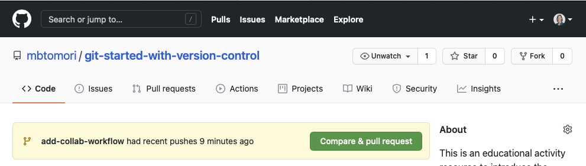
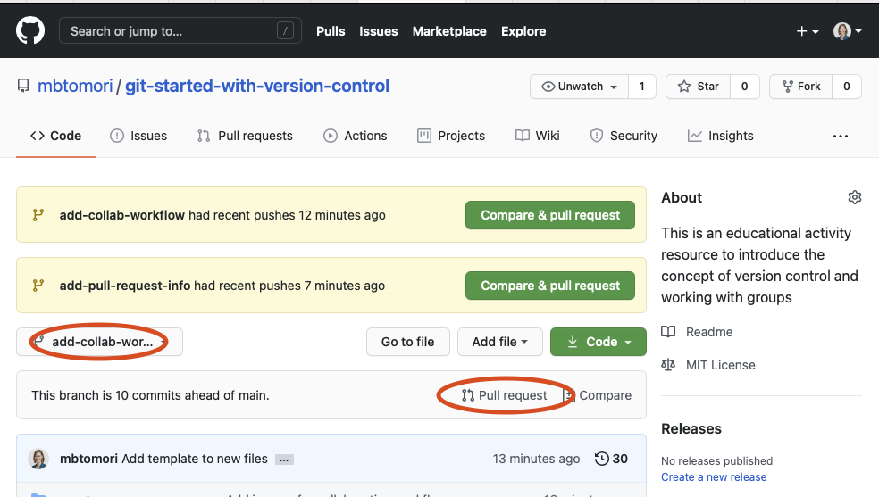
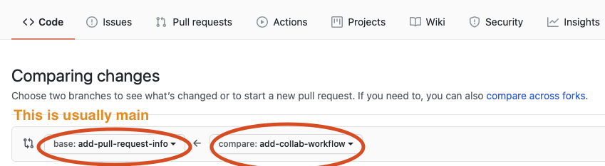
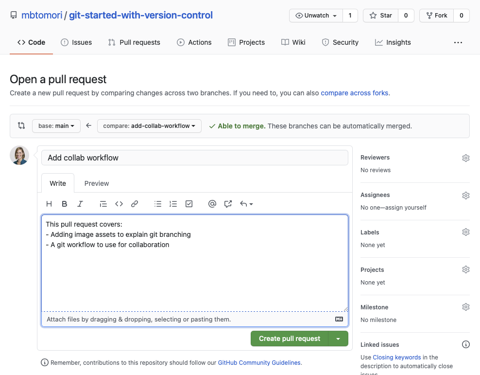
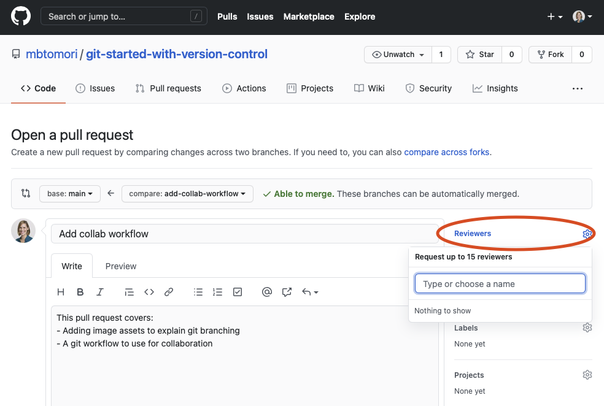
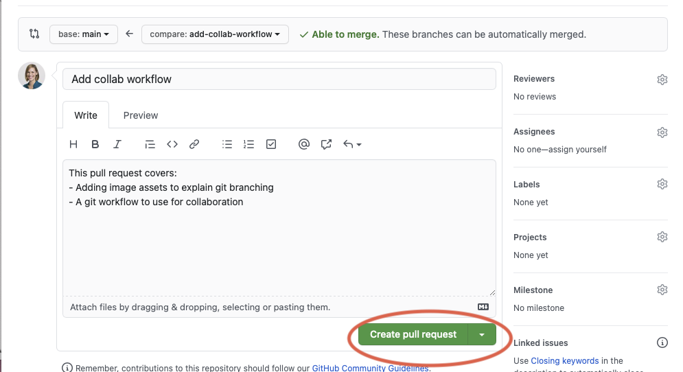

# Activity 6: Making Pull Requests

## Learning Outcomes
- [ ] Create a pull request
- [ ] Add feedback to a pull request

## Overview
GitHub has powerful features to ease collaboration and make it easier to give and receive feedback. This is mainly
done using the Pull Request feature in GitHub. In this activity, you will learn the steps to create a pull request for
others to review. 

#### 1. Click the "Compare & pull request button"
When you push a repository to a remote branch. GitHub will prompt you to create a pull request. Click on the 
green button to start.

*If this dialog doesn't appear, go to the branch you want to make a pull request from, and click pull request*

#### 2. Select the branch to merge your changes into
Most of the time, you will likely want to merge your changes into main, but sometimes you may want to merge your changes
into another feature branch. GitHub will automatically select main, but you'll want to update it if you want to merge
to a different remote branch.

#### 3. Add information about what you changed
It's a good practice to add information about what you changed in the code. 

Also, be sure that the files that are in the branch are the files you want merged. 

*If it has more files than you actively 
changed and want included, you'll need to go through the process of removing commits, which is more challenging.
If you are newer to git, it is often easier to go to the main branch, create a new branch, and copy the changed files 
over than cherry-picking or rebasing.(Although those are both valid options too). If you find yourself in this situation, 
it's likely because you added too many files to your stage using `git add .`*

#### 4. Add Reviewers or Assignees
If you are working with others, you may want (or need) to assign specific people to review your code. You can do this
using the "Reviewers" or "Assignees" boxes to the right. Click on the gear and assign people using their GitHub username. 
Any collaborators on the project should be easy to find. 

You'll notice there are also sections for labels, projects, etc. Your team can decide whether to use these fields or not.

#### 5. Create the pull Request
Click the big green "Create pull request" button and you're done!

Most people will have notifications set up to receive messages if they are assigned as a reviewer or assignee, but it
never hurts to let them know you created a pull request for them to review. 

## Summary: Steps for Pull Requests
1. Push your local branch to GitHub using `git push origin <branchname>` if you haven't already
2. Go to that repository on GitHub
3. Click the "Compare & pull request" button at the top of the screen (or use the alternative method)
4. Select the branch you want your changes merged into
5. Add content regarding what code you added or changed and why
5. Add reviewers, assignees, labels, projects, etc. as desired
6. Click Create pull request

## Activity
Create a pull request for the changes to your Notes file from this workflow to get some practice.

*Have something you want to add here? Use this workflow to create a new branch and add your changes. You'll learn how to 
make a Pull Request to the original repo in a later activity!*

## Next Step:
Go to [7-collaboration-best-practices](7-collaboration-best-practices.md) to go to the next activity.