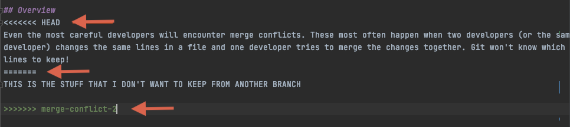

# Activity 8: The dreaded MERGE CONFLICT

## Learning Outcomes
- [ ] Identify situations that are likely to create merge conflicts
- [ ] Resolve merge conflicts when they arise

## Overview
Even the most careful developers will encounter merge conflicts. These most often happen when two developers (or the same
developer) changes the same lines in a file and one developer tries to merge the changes together. Git won't know which
lines to keep!

Merge conflicts can prevent git from starting to merge or they can happen in the middle of an attempted merge. If a
conflict happens before the merge is started, git will direct you to commit your changes, stash them, or checkout a new 
branch. 

If you have a conflict that arises during a merge, you will need to "resolve" the conflict in the affected files. 
This is where it is important to read the conflict message carefully in your terminal because you won't be able to 
merge until all conflicts are resolved, and the changes are committed.

## Steps for Resolving Merge Conflicts:
1. Find the file(s) with the merge conflict. 
2. In the file, you will see something like:

Your job is to delete the code that should be deleted as well as the merge conflict syntax around it. 
   In this case, you would need to delete the <<<<<<<HEAD, and then everything from ====== to >>>>>>merge-conflict-2.
    
3. Once the content that should be deleted is removed, you'll need to add your files to the stage and commit your changes. 
4. If all of your merge conflicts have been resolved, git should be able to complete the merge.

Merge conflicts can be stressful. The main thing you need to remember when dealing with one is to take a deep breath, 
and then carefully select the content you don't want to keep. If you have been committing often, you should be able to 
recover most of your code if you make a mistake. 

## Activity
Go through Atlassian's [Git Merge Conflicts](https://www.atlassian.com/git/tutorials/using-branches/merge-conflicts)
tutorial to create and resolve a merge conflict.

#### Previous git commands
- `git stash`[Atlassian: git commit](https://www.atlassian.com/git/tutorials/saving-changes/git-commit)

*Have something you want to add here? Use this workflow to create a new branch and add your changes. You'll learn how to 
make a Pull Request to the original repo in a later activity!*

## Next Step:
Go to [9-Completion-Lob](9-completion-log.md) to go to the next activity.